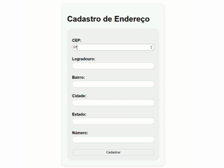

[](LICENSE)

# ViaCEP_API



Projeto simples em JavaScript que consome a API pública do ViaCEP para busca de endereços a partir de CEP (Código de Endereçamento Postal) no Brasil. É uma excelente forma de praticar requisições HTTP, tratamento de erros e manipulação de DOM.

## Tecnologias utilizadas
- JavaScript (ES6+)
- HTML5, CSS3
- API ViaCEP (JSON)
- Fetch API

##  Como usar
1. Clone o repositório:
   ```bash
   git clone https://github.com/saarrr-alves/ViaCEP_API.git
2. Abra o arquivo `index.html` no navegador de sua preferência.
3. Insira um CEP no formato xxxxxxxx e clique fora do input de digitação do CEP.

## Funcionalidades
- Busca de endereço (logradouro, bairro, cidade, estado) via CEP
- Tratamento de CEPs inválidos ou não encontrados
- Feedback amigável ao usuário (mensagem de erro, loading, etc.)
- Validação de CEP com regex (apenas números e 8 dígitos)

## Exemplo de uso
|  Entrada (CEP) |                     Saída                     |
|----------------|-----------------------------------------------|
|   01001-000    |        Praça da Sé, Sé, São Paulo – SP        |
|   00000-000    | CEP não encontrado, mensagem de erro exibida  |

## Estrutura do Projeto
```pgsql
├── index.html
├── style.css
└── script.js
└── README.md
└── preview.gif
```

## Próximos passos (Roadmap)
- Tratamento de loading UI com spinner ou animação suave
- Adicição de botão de pesquisa de CEP de forma mais intuitiva
- Estilo responsivo com layout mobile-first ou tailwind/bootstrap
- Testes automatizados com Jest ou Cypress

## Como contribuir
Contribuições são super bem-vindas!

1. Fork este repositório.
2. Crie uma branch para sua feature ou correção (git checkout -b minha-feature).
3. Faça suas alterações, teste e commit (git commit -m "Descrição do que fez").
4. Abra um Pull Request — vamos adorar revisar junto!

## Licença
MIT License — sinta-se à vontade para usar, modificar e compartilhar este projeto.